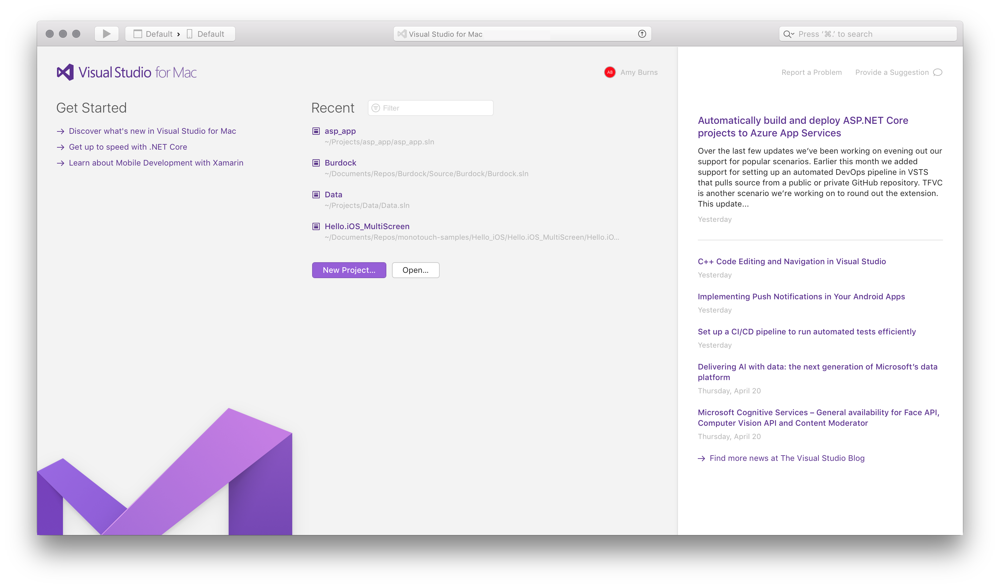

# Visual Studio 2017 for Mac tour

> [!NOTE]
> Visual Studio 2019 for Mac is [now available](installation.md).

Visual Studio for Mac is a .NET _integrated development environment_ on the Mac that can be used to edit, debug, and build code and then publish an app. In addition to expected features, such as a standard editor and debugger, Visual Studio for Mac includes compilers, code completion tools, graphical designers, and source control to ese the software development process.

Visual Studio for Mac supports many of the same file types as its Windows counterpart, such as `.csproj`, `.fsproj`, or `.sln` files, and supports features such as EditorConfig, meaning that you can use the IDE that works best for you.
Creating, opening, and developing an app will be a familiar experience for anyone who has previously used Visual Studio on Windows. In addition, Visual Studio for Mac employs many of the powerful tools that make its Windows counterpart such a powerful IDE. The Roslyn Compiler Platform is used for refactoring and IntelliSense. Its project system and build engine use MSBuild, and its source editor supports TextMate bundles. It uses the same debugger engines for Xamarin and .NET Core apps, and the same designers for Xamarin.iOS and Xamarin.Android.

## What can I do in Visual Studio for Mac

Visual Studio for Mac supports the following types of development:

- ASP.NET Core web applications with C#, F#, and support for Razor pages, JavaScript and TypeScript
- .NET Core console applications with C# or F#
- Cross-platform Unity games and applications with C#
- Android, iOS, tvOS, and watchOS applications in Xamarin with C# or F# and XAML
- Cocoa desktop apps in C# or F#

This article explores various sections of Visual Studio for Mac, providing a look at some of the features that make it a powerful tool for creating these applications.

## IDE Tour

Visual Studio for Mac is organized into several sections for managing application files and settings, creating application code, and debugging.

## Welcome Screen

When launched, Visual Studio for Mac displays a *Welcome Screen*:

