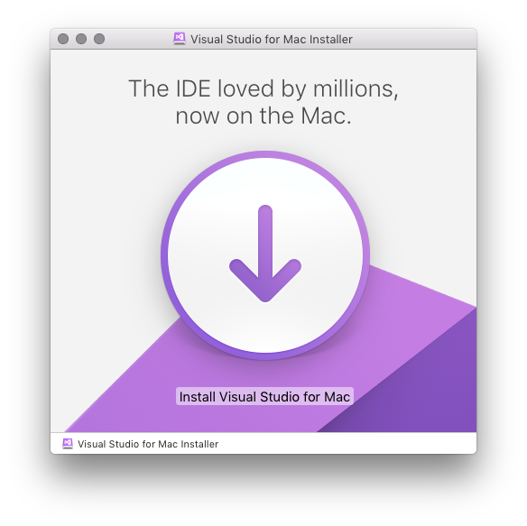

# Install Visual Studio 2017 for Mac

> [!NOTE]
> Visual Studio 2019 for Mac is [now available](installation.md?view=vsmac-2019). For older versions of Visual Studio for Mac, see the Visual Studio [downloads page](https://my.visualstudio.com/Downloads?q=Visual%20Studio%202017%20for%20Mac).

## Requirements

To start developing native, cross-platform apps when you download Visual Studio for Mac there are a couple of things that you must install and set up in preparation.

For working with iOS in Visual Studio you need the following pieces:

- A Mac with macOS High Sierra 10.13 or above.
- Xcode 9.3 or above. The latest stable version is usually recommended.
- An Apple ID. If you don't have an Apple ID already you can create a new one at https://appleid.apple.com. It's necessary to have an Apple ID for installing and signing into Xcode.

## Install

1. Download Visual Studio for Mac from [my.visualstudio.com](https://my.visualstudio.com/Downloads?q=Visual%20Studio%202017%20for%20Mac)

2. Once the installer package is downloaded, click the **VisualStudioForMacInstaller.dmg** file to mount the installer and then run it by double-clicking the logo, as illustrated by the following image:

   